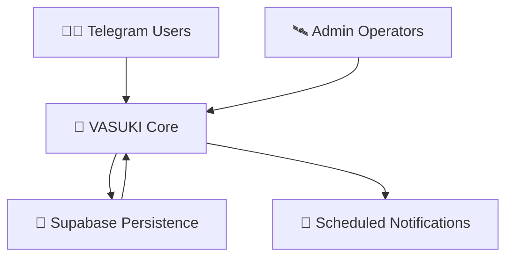

<!-- ========================================================= -->
<!-- CORECONNECTTG :: VASUKI • GLITCH REACTOR EDITION -->
<!-- ========================================================= -->

<p align="center">

<svg width="130" height="130" viewBox="0 0 200 200">
  <defs>
    <linearGradient id="coreGlow" x1="0%" y1="0%" x2="100%" y2="100%">
      <stop offset="0%" stop-color="#00F5FF"/>
      <stop offset="100%" stop-color="#ff00ff"/>
    </linearGradient>
  </defs>

  <circle cx="100" cy="100" r="90" fill="none" stroke="url(#coreGlow)" stroke-width="4"/>
  <circle cx="100" cy="100" r="68" fill="none" stroke="#00F5FF" stroke-width="1.2"/>

  <text x="50%" y="54%" text-anchor="middle"
        font-size="34"
        fill="#00F5FF"
        font-family="monospace">
        VSK
  </text>
</svg>

</p>

<p align="center">
  
</p>

<p align="center">
  
</p>

<p align="center">
  
  
  
  
</p>

---

```
⚠ SYSTEM ALERT :: GLITCH REACTOR ACTIVE
━━━━━━━━━━━━━━━━━━━━━━━━━━━━━━━━━━

Signal integrity fluctuating.
Persistence layer stable.
VASUKI continues to operate.
```

---

# 🧠 CORECONNECTTG :: VASUKI

VASUKI is a persistence-driven Telegram academic automation bot engineered to maintain **operational continuity within high-noise communication environments**.

Academic groups generate transient information streams.

VASUKI enforces structure.

Schedules persist.  
Announcements remain predictable.  
System state survives restarts.

The bot is designed for **stability, not volatility**.

---

<p align="center">
  
</p>

# 🚀 DESIGN OBJECTIVES

CoreconnectTG exists to eliminate academic communication friction.

Common failure modes:

❌ Missed updates  
❌ Lost scheduling memory  
❌ Manual reminder overhead  
❌ Restart instability  

VASUKI introduces:

✔ Cloud-backed persistence  
✔ Deterministic scheduling cycles  
✔ Multi-admin governance  
✔ Restart-safe state recovery  

---

<p align="center">
  
</p>

# 🛰️ SYSTEM COMPONENTS

| Module | Stability Role |
|--------|----------------|
| **Telegram Interface** | Interaction Layer |
| **Bot Logic Core** | Python Execution Engine |
| **Supabase Memory** | Persistent JSONB Storage |
| **Scheduler Engine** | Notification Dispatcher |
| **Flask Keep-Alive** | Runtime Stability Anchor |

---

<p align="center">
  
</p>

# 🧬 SIGNAL FLOW MODEL



---

<p align="center">
  
</p>

# 🎛️ ADMIN CONTROL FIELD

Authorized operators may dynamically control:

• Subject schedules  
• Notification offsets  
• Announcement propagation  
• Admin hierarchy  
• Resource messaging  

All actions synchronize with Supabase.

No volatile state.

---

---

<p align="center">
  
</p>

# 🛰️ SYSTEM TELEMETRY :: DIAGNOSTIC MATRIX

```
SIGNAL TRACE ACTIVE
REPOSITORY ENERGY STABLE
NEURAL OUTPUT NOMINAL
```

<p align="center">


</p>

---

<p align="center">
  
</p>

# ⚡ CONTRIBUTION CURRENT :: ACTIVITY FLOW

<p align="center">
  
</p>

---

<p align="center">
  
</p>

```
DIAGNOSTIC SUMMARY
━━━━━━━━━━━━━━━━━━━━━━

✔ Persistence Layer Stable
✔ Scheduler Engine Active
✔ Signal Flow Continuous
✔ Telemetry Interface Operational
```

---

# 🛠️ INSTALLATION PROTOCOL

```bash
git clone https://github.com/avadaKedavaaraa/coreconnecttg.git
cd coreconnecttg
python3 -m venv venv
source venv/bin/activate
pip install -r requirements.txt
```

---

# 🔐 ENVIRONMENT MATRIX

Create `.env` file:

```
BOT_TOKEN=your_token
SUPABASE_URL=your_url
SUPABASE_KEY=your_key
ADMIN_USERNAMES=user1,user2
GROUP_CHAT_ID=group_id
GEMINI_API_KEY=optional
ADMIN_PASSWORD=optional
```

⚠ Protect credentials.

---

# 🚀 LAUNCH SEQUENCE

```bash
python main.py
```

Flask keep-alive server initializes automatically.

---

<p align="center">
  
</p>

<p align="center">
<b>VASUKI :: Glitch Reactor Contained ⚡🚀</b>
</p>
